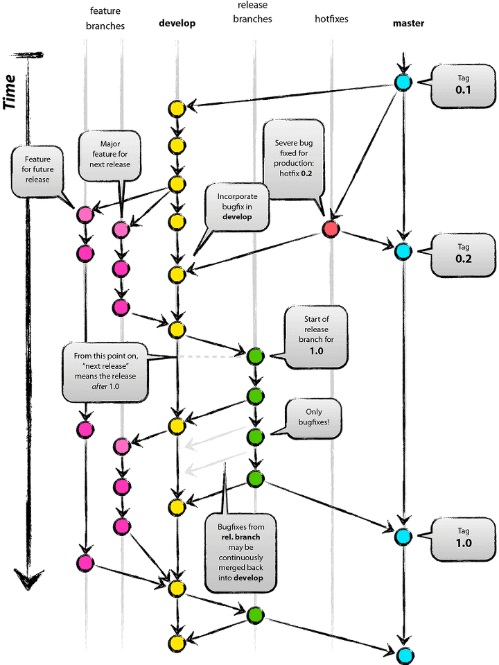

# 복습

## git ? 

* 분산버전관리시스템

  * 분산해서 버전을 관리
    * 어떻게? 커밋을 해서 

  > *예시*
  >
  > \( 보고서를 쓰는 도중 )
  >
  > 1. 서론
  > 2. 본론
  > 3. 결론
  >
  > 각 단계는 하나의 버전으로 볼 수 있다

* repository (저장소)

  1. 파일 생성 또는 수정 
  2. add ( 커밋할 파일 상태, 커밋할 파일로 변경, 2통)
  3. 커밋 (버전기록)

  

* GitHub 🕰n커밋 부분을 누르면 지금까지의 커밋 기록을 확인할 수 있음 
* git add * 는.gitignore를 고려하지 않고 모두 add 
* git add . 는 .gitignore에 등록된 파일 제외하고 add
* git add 파일명.확장자 파일명.확장자 파일명.확장자 하면 여러 파일 몇 개만 가능

* **커밋 = 행위에 대한 기록**

> *커밋 메세지 예시 1*
>
> 

> *커밋 메세지 예시 2*
>
> 

~~복습 겸 내가 해서 이미지 넣기~~

* git checkout 해쉬값(=커밋할 때마다 생성대는 고유번호) : 이전 커밋으로 백 
* 커밋한 모든 내용은 다시 되돌릴 수 있다
* 커밋하지 않은 모든 내용은 지워졌을 경우 되돌릴 수 있는 방법이 없음 
* 파일 수정, 파일명 변경, 폴더명 변경, 생성, 이동 모두 원래 하던대로 하고 커밋-푸쉬 
  * ex 뭐하나 지우고 싶을 때, 로컬에서 지우고 커밋 후 푸쉬 


# 본강


## push and pull

* 로컬 저장소 -push- 원격 저장소 - pull - 원격 저장소 


## clone

* Git clone 'url'
  * 경로에 해당주소 파일들 생김 


* Clone 시 주의점 

  1. 클론해준 원격저장소 이름의 폴더가 경로에 생성된다
  2. Github 주소에서 download zip을 하면 그냥 최신버전의 파일/폴더만 가져오는 것
  3. 분산버전관리의 목적으로 사용하는 것이라면 무조건 다운이 아닌 clone 명령어를 사용할 것
  4. clone으로 내 로컬에 저장된 것도 하나의 버전인 셈
  5. download한 것에 git init을 하면 전혀 다른 새로운 root로 시작하는 것
  6.  **내 프로젝트 안에 다른 프로젝트를 클론하지 말 것**

  

1. 클론 후 권한이 있는 사람이 추가로 커밋해서 푸쉬를 함
2. 그럼 그걸 다시 내 로컬에 업뎃해서 작업하고 싶다 ? 
   * git pull origin master 
3. 이후 작업 진행 but root-뭐시기가 없어서 push 불가


* Pull = 변경된 커밋을 받아오는 것 
* **clone** = 저장소를 받아오는 것 
  * so, `git clone` 이후 추가로 git init을 하지 않는다

> *예*	 팀프로젝트 시 
>
> 조장 로컬저장소 생성 `git init` --push-- 원격저장소 github
>
> 조원 														   조장한테 권한 받기 -`git clone` - 작업 시작


## branch, GitHub flow

* git을 cli에서 활용하기 위해서 `git status` 로 계속 확인해주기 


#### git flow

* git을 활용하여 협업하는 흐름으로 branch를 활용하는 전략

  > *예시*
  >
  > 
  >
  > master가 사용자가 보는 화면이라고 생각하면 됨. = 배포
  >
  > > 마스터가 릴리즈했는데 어....? 하면 큰일남

#### Branch merge 

* 각 branch에서 진행한 작업들을 통합

* Branch = 가지, 즉 뿌리가 필요하다
* 시작 전 항상 루트폴더 생성

이미지 b1,2,3,4 넣기 

Head ? 

젤 최신 커밋....? 

머지는 암데나에서 해도 되는데 

Git merge 합칠가지이름 을 하면 내 가지에서 합칠가지가 합쳐짐 몬말알 ?

Branch -d example 가지 지우는거, 근데 다른가지에 머지해놨다면 다른가지에 파일 안지워짐 


##### 상황별 예시

1. 조장 혼자 보고서 doc, 발표 ppt 다 작성
2. 조장 보고서 doc, 조원 발표 ppt 각각 작성
3. 조원 보고서 doc 조원도 보고서 doc


###### 상황 1. fast-forward

* 혼자 작업, 조원 프리라이딩

  1. 홈화면을 만든다

     `git branch feature/home`

  2. 홈브랜치로 이동

     `git checkout feature/home`

  3. 작업완료 후 커밋 

     ```bash
     % touch home.txt
     % git add .
     % git commit -m 'home complete'
     
     ```

     

* master = feature/home 이 되어버림. 결국 가지 하나인 셈.


###### 상황 2. Merge commit

* 보고서 파일 + 발표자료 파일 각자 커밋 발생, 다른 파일만 수정된 경우

  1. 가지 생성 이동 바로

     `git checkout -b feature/about`

  2. 작업하고 커밋하고 로그 확인 

  3. 마스터로 이동 

     `git checkout master`

  4. master에 추가로 커밋 있는 상황 

  5. 피쳐홈 로그랑 마스터 로그랑 비교해보자 

     * 마지막 커밋 버전 다름

  6. 마스터에서 머지하면 done

     `git merge feature/about`

  7. 이미 병합한 브랜치는 삭제한다.  (무조건)


###### 상황3. Merge commit 충돌

* 각자 커밋이 있는데, 같은 파일이 수정됨

  1. 각 branch에서 작업했는데, 동일한 파일이 수정 또는 생성됨 
  2. 마스터로 돌아와서 merge 시도 시 conflict 발생함 
     * Mater|merging 으로 변경됨
  3. status해보면 머지 안된 부분들 리스트 나옴 
  4. 그리고 충돌이 일어난 파일을 열어보면 또 알려줌 
  5. 협의하면서 파일 수정 후 커밋 하면 예쁜 그래프~~

   


