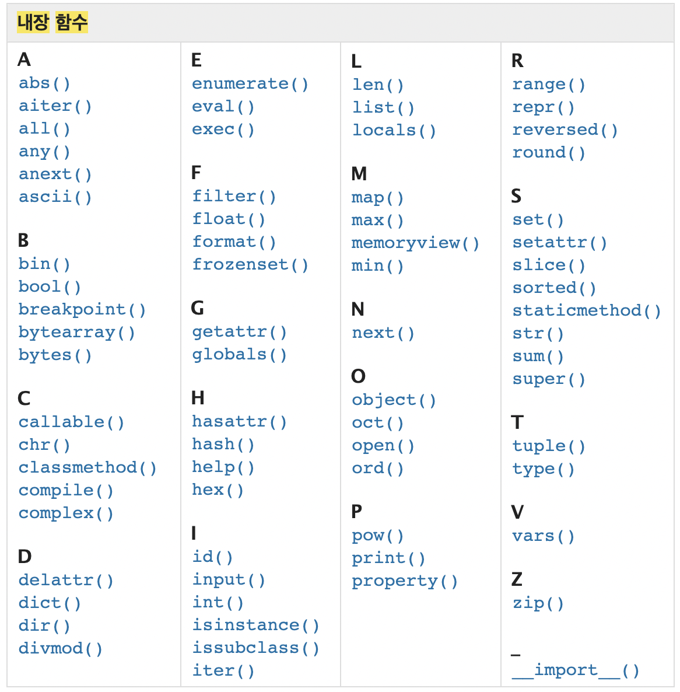

# 함수

+ ##명령적 지식 imperative knowledge## - "how to ?"
+ 변수와 타입 
  + Int float complex bool str list tuple range set dictionary 등등

> `len('happy!')`
>
> 는 6 


+ 앞으로 구구절절 쓰는거 보다 짧게 만들어놓은 함수 사용 

> `sum([1, 10, 100])`

+ decomposition 기능을 분해하고 재사용이 가능 
+ Abstraction 복잡한 내용을 숨기고, 기능에 집중하여 사용하도록 만들어준다.
  + 블랙박스 : 안에 뭐가 들어있는지 모르는 상자 
    + Input -> //블랙박스// -> Output
  + Name = 복잡한 부분, 컴터 안 어딘가에는 저장되어있는 뭐시기뭐시기, 수많은 데이터 중 하나 
    + name이라는 키워드로 명명해서 데이타 호출하는 
+ 함수 = **function** 기능 
  + ex- print는 출력하는 기능 

* 내장 함수

  

  

* 코드를 사용해야하는 이유 ? 

  + 코드 중복 방지 
  + 재사용 용이 

  

  

### 함수 기본 구조 

* 선언과 호출 
* 입력 
* 범위 
* 결과값 


#### 선언과 호출 

+ Def 를 활용 
  + def 없이 함수만 쓸 경우 정의되지 않은 함수라고 에러뜸 
  + print 같이 내장함수면 def 안써도 호출가능

+ 들여쓰기로 펑션 바디를 불러옴 

+ 함수는 함수명()으로 호출 
  + parameter가 있는 경우, 함수명(값1, 값2...) 로 호출

```python
def foo():
    return true
 
def add(x,y):
    return 
  
def add(a,b):
    return a + b
```

	1. def 
	1. 함수 이름 : ex) add 
	1. Input : a, b 
	1. Return : 값을 반환 
	1. print 호출 


문제풀이 할 때 파이썬튜터에 넣어보면 다계별로 계산하는거 나온다 


#### 함수의 결과값 

+ 함수는 반드시 값을 하나만 리턴한다 

+ 함수라인

  리턴 

  리턴      이렇게 되면 위에 값만 처리하고 밑에  리턴 스킵하는게 아니고 

  하나의 튜플로 반환한다 

+ none

+ 프린트는 출력만 해주고 디턴 값은 

+ 아아악 점심까지 한시간 

+ return은 값을 반환하기 위해 사요오딤 

+ print 출력을 위해서 사용됨 


#### 함수의 입력(input)

+ parameter : 함수 실행 시 내부에서 사용되는 식별자 

+ argument : 함수 호출 시 넣어주는 값 

  ```python
  def function('ham')
      return(function)
  ```

##### positional arguments

+ 함수 호출 시 argument는 위치에 딸 ㅏ함수 내에 전달 됨 

##### keyword arguments

+ 직접 변수의 이름으로 특정 아규먼트 전달 가능 
+ 키워드 쓰면 포지셔널 활용 불가 

```python
def add(x, y):
    return(x, y)
  
  add
```


> `print('hi', 'hello', sep='-') 


##### default argument values

+ 기본값 지정해서 함수 호출 시 아규먼트 값을 설정하지 않도록 

+ print의 경우 

  + sep=' ' 로 디폴트가 숨겨져있음 그래서 'Hi', 'hello' 입력 시 알아서 띄어쓰기되는 것 
  + Value = !?
  + 정해지지 않은 개수의 argument 

  ```python
    # 정해지지 않은 개수의 인자
  def my_add(*numbers): # 내부적으로 numbers가 tuple
      return numbers
    
  result = my_end(1, 2, 3)
  print(result)     # tuple
  ```

  

  ```python
  def my_func(""kwargs): # 키워드로 부를 때 쓰는 것 
      return kwargs
  print(result) = my_func(name='홍', age='100')  # dictionary
  ```


##### 함수의 범위 scope 

+ global 외부
+ Built in 
+ enclosed 
+ local 


내장함수의 이름으로 변수이름 이어버리면 그 다음에 안서짐 

이름공간에 다 저장되잇음 

`


#### map 

Numbers = ['1', '2', '3']

n = int(numbers) 가능 ? 

불가능 숫자를 리스ㅡㄹ 변환 불가하다 

a = Int(number[0])

b = ''

c = ''

이렇게 가능하기 한데 100개 10000개 일때는 ?  좀.. 

New_numbers = [a, b, c]

+ 반복문 

```python 
numbers = ['1', '2', '3']
print(numbers)
new_numbers = []
new numbers.append(int(numbers))

```

이렇게 쓰면 넘 길고 구구절절 그래서 생긴게 map

```py
new_numbers_2 = map(int, numbers)
print(new_numbers_2) # 출력결과에 멥 오브젝트 엣 뭐시기뭐시기 뜨는데 이거 오류 아니고 이미 함수 적용됐다는 뜻 
print(list(new_numbers_2)) # 리스트로 형변환해서 보면 바뀌어있는거 확인 가능. 꼭 리스트로 바궈야하는거는 아님. 윗줄 상태로 활용 가능하다
```

여기서 type(new_numbers_2)  형변환해보면 맵으로 돼잇음 


문자열.split() 공백을 기준으로 쪼개겠다 

반환결관ㄴ 항상 스트링

`n. m' = map(int, input().split())

맵은 어떠한 함수를 반복가능한 것들의 요소에 모두 적용시킨 결과 

int 함수를 inpuT의 모든 요소에 적용한 결과  

int 도 내장함수이다 ~! 

***반복문을 써야하는 것을 간단하게 처리해주는 것 = map***


Functional iterable 와 진자 

 


+ sep ' ' 

+ end '\n'


😭


