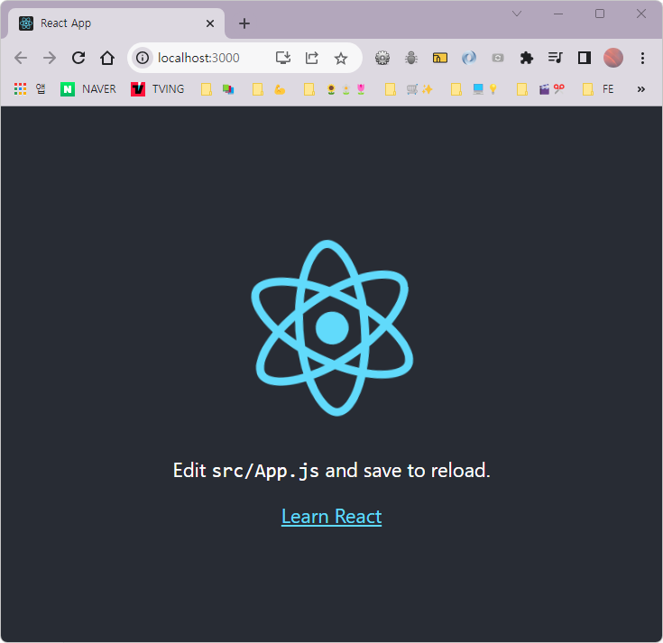

# React 개발 환경

## 필수 프로그램 설치

+ 크롬 

+ vs code

+ git

+ node

  > ***npm & yarn*** *<u>프론트엔드 의존성</u>을 관리하기 위한 <u>패키지 매니저</u>*
  >
  > 3rd-party package들이 모여있는 집합소
  >
  > + **npm** 
  >   + node package manager
  >   + node.js를 설치할 때 자동으로 생성
  > + **yarn**  
  >   + 2016년에 페이스북에서 개발한 패키지 관리자
  >   + npm과의 호환성이 좋고, 속도나 안정성 측면에서 npm보다 월등히 좋음.


## javascript 런타임 환경의 종류

### 런타임? 

+ 프로그래밍 언어가 구동(running)되는 환경(environment)

+ 우리가 사용하는 건 뭐다? *Javascript*

  + 자바스크립트의 대표적인 런타임 환경

    1. 브라우저 환경 

       (ex. Chrome, Microsoft Edge, Firefox 등)

    2. Node 환경


## CRA(Create React App)

+ Set up a modern web app by running one command.

  (하나의 명령으로 React 프로젝트 개발에 필수 요소를 자동으로 구성)

+ React 프로젝트를 구성하기 위해 필요한 것들(ex. react, react-dom, WebPack, babel, eslint)을 하나 씩 설정하면서 프로젝트를 시작하는 것이 아니라 명령어 입력 하나면 해당 요소들이 자동으로 구성된다.


### CRA로 프로젝트 생성하기

```bash
ls # 현재 경로 확인

cd 폴더이름 # 리액트 프로젝트를 생성하고 싶은 폴더로 이동

yarn create react-app week-1 # 프로젝트 생성
```

1. 리액트 프로젝트를 생성하고 싶은 위치에서 `yarn create react-app week-1` 실행

   + window : `git bash` or `power shell`

   + mac os : `terminal`

```bash
We suggest that you begin by typing:

  cd week-1 👈🏻
  yarn start

Happy hacking!
```

2. 생성된 프로젝트 폴더로 이동 후, `yarn start`로 시작🎉

> 종료는 그냥 터미널에 커서가 있는 상태로 
>
> + window : `ctrl + c`
>
> + mac os : `control + c`


이제는 `프로젝트폴더/src/App.js`파일을 수정하고 저장하면 새로고침이 없어도 UI가 자동 업데이트가 된다.




## React 프로젝트 폴더 뜯어보기

1. `pjt/public/index.html`

   ```react
   <body>
       <noscript>You need to enable JavaScript to run this app.</noscript>
       <div id="root"></div>
   </body>
   ```

2. `pjt/src/index.js`

   ```react
   const root = ReactDOM.createRoot(document.getElementById('root'));
   root.render(
       <React.StrictMode>
       	<App />
       </React.StrictMode>
   );
   ```

3. ⭐`pjt/src/App.js`⭐

   ```react
   function App() {
     return (
       <div className="App">
         <p>Hello React</p>  //👈 여기에 모든 코드를 작성
       </div>
     );
   }
   
   export default App;
   ```


### 절대경로로 작성할 수 있게 세팅 (선택사항)

1. 프로젝트 폴더 내에 `jsconfig.json 파일 생성` 

2. 파일 내에 아래 코드 작성 후 저장

   ```json
   {
       "compilerOptions" : {
           "baseUrl" : "src"
       },
       "include" : ["src"]
   }
   ```

3. 이제 `import './App.css';` 경로를 `import 'App.css';` 이렇게 바꿔도 실행된다.

